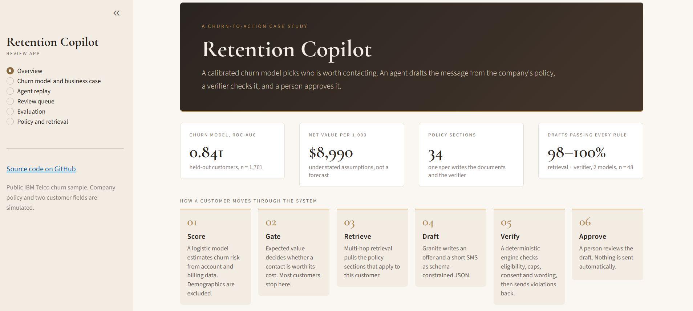
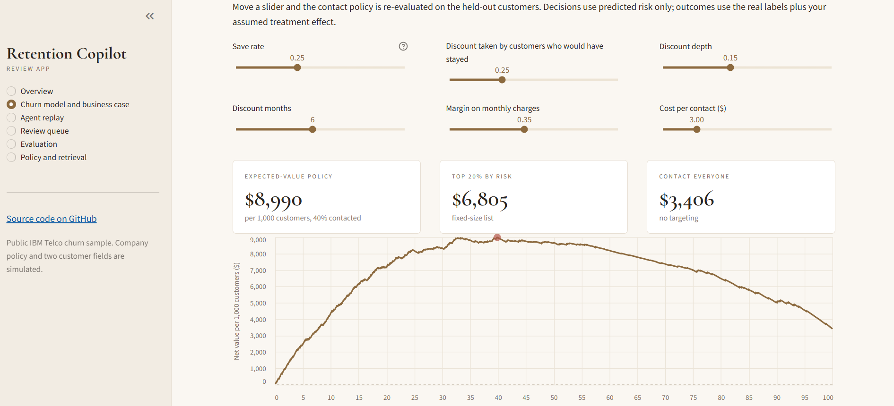
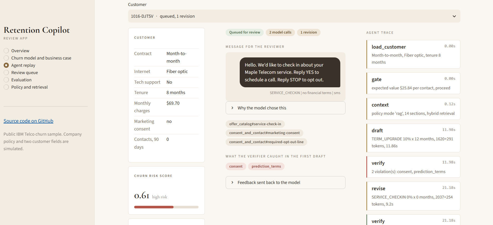
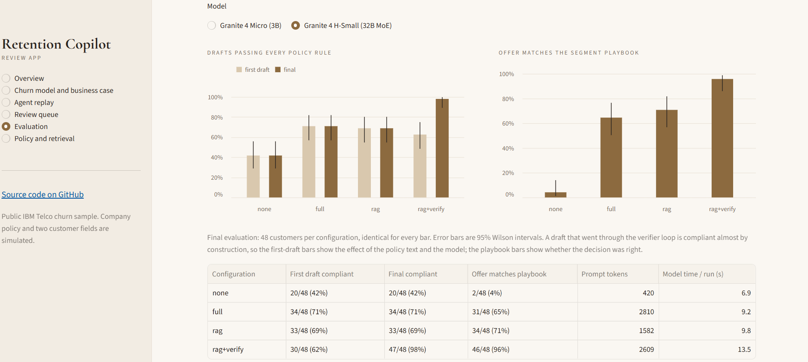
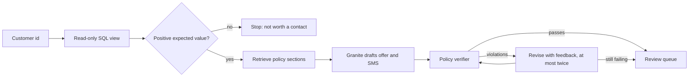

# Retention Copilot

[](https://github.com/Randeep-Sidhu/Retention-copilot/actions/workflows/tests.yml)

   **Live demo:** [https://retention-copilot-r-s.streamlit.app/](https://retention-copilot-r-s.streamlit.app/) (the free host puts the app to sleep, so the first load can take about 30 seconds)

Churn models usually stop at a score. This project takes the next step: for a customer who is worth contacting, it drafts the retention message, checks the draft against a written company policy, and puts it in front of a person to approve.

There are four pieces. A logistic regression ranks customers by churn risk, and an expected-value rule decides who is worth the cost of a contact. A LangGraph agent reads the policy sections that apply to the customer and drafts an offer and a short SMS with IBM's Granite 4 model. A rule-based verifier checks the draft and sends any violations back to the model. A review queue holds the result until someone approves or rejects it.

I built it to practise the parts of applied data science that coursework tends to skip: choosing a model with a statistical argument instead of a leaderboard number, saying plainly which numbers are assumptions, and evaluating a language-model system on customers it was never tuned on.

## Screenshots

<!-- SCREENSHOTS:START -->
<table>
<tr><td width="50%" valign="top"><a href="docs/img/01-overview.png"></a><br><sub>Overview</sub></td><td width="50%" valign="top"><a href="docs/img/02-what-if.png"></a><br><sub>What-if economics on the held-out customers</sub></td></tr>
<tr><td width="50%" valign="top"><a href="docs/img/03-agent-replay.png"></a><br><sub>Agent replay: one customer, start to finish</sub></td><td width="50%" valign="top"><a href="docs/img/04-evaluation.png"></a><br><sub>Evaluation: policy source and verifier loop</sub></td></tr>
</table>
<!-- SCREENSHOTS:END -->

## Results

### The churn model

<!-- MODEL:START -->
On the held-out test set (1,761 customers, 26.5% churn overall) the logistic model reaches ROC-AUC 0.841 and PR-AUC 0.645. Gradient boosting, given its natural inputs, reaches 0.843 and 0.658. The paired bootstrap difference in ROC-AUC is +0.0024 (95% CI -0.0020 to +0.0070). The interval includes zero, so I kept the logistic model, which I can explain customer by customer.

Under the assumptions listed in [the model card](reports/model_card.md), contacting only customers whose expected value is positive reaches 40% of them and is worth about $8,990 per 1,000 customers. Contacting everyone is worth $3,406 and a fixed top-20% list $6,805. Across the sensitivity grid the proposed policy ranges from $464 to $25,851 per 1,000, so the method and its sensitivity are the result here, not the single figure.
<!-- MODEL:END -->

### The agent

`granite4-micro` is Granite 4.0 Micro (3B parameters). `granite4-small-h` is Granite 4.0 H-Small, a 32B mixture-of-experts model with about 9B parameters active per token.

<!-- RESULTS:START -->
48 held-out customers, the same for every row. CI is a 95% Wilson interval.

| model | configuration | first draft compliant | final compliant | offer matches playbook | prompt tokens | model time / run |
|---|---|---|---|---|---|---|
| granite4-micro | none | 1/48 (2%, CI 0-11) | 1/48 (2%, CI 0-11) | 23% | 420 | 2.8s |
| granite4-micro | full | 26/48 (54%, CI 40-67) | 26/48 (54%, CI 40-67) | 23% | 2810 | 3.6s |
| granite4-micro | rag | 27/48 (56%, CI 42-69) | 27/48 (56%, CI 42-69) | 42% | 1582 | 3.3s |
| granite4-micro | rag+verify | 28/48 (58%, CI 44-71) | 48/48 (100%, CI 93-100) | 65% | 3290 | 5.7s |
| granite4-small-h | none | 20/48 (42%, CI 29-56) | 20/48 (42%, CI 29-56) | 4% | 420 | 6.9s |
| granite4-small-h | full | 34/48 (71%, CI 57-82) | 34/48 (71%, CI 57-82) | 65% | 2810 | 9.2s |
| granite4-small-h | rag | 33/48 (69%, CI 55-80) | 33/48 (69%, CI 55-80) | 71% | 1582 | 9.8s |
| granite4-small-h | rag+verify | 30/48 (62%, CI 48-75) | 47/48 (98%, CI 89-100) | 96% | 2609 | 13.5s |

**granite4-micro.** With retrieval and the verifier loop, 48 of 48 final drafts passed every rule; the first drafts passed 28 of 48, and the offer matched the segment playbook 65% of the time. With no policy text the same model passed 1 of 48 and matched the playbook 23% of the time. Retrieval versus no policy on playbook matching: 17 customers only with retrieval, 8 only without (exact McNemar p = 0.1078, not significant at the 5% level).

**granite4-small-h.** With retrieval and the verifier loop, 47 of 48 final drafts passed every rule; the first drafts passed 30 of 48, and the offer matched the segment playbook 96% of the time. With no policy text the same model passed 20 of 48 and matched the playbook 4% of the time. Retrieval versus no policy on playbook matching: 32 customers only with retrieval, 0 only without (exact McNemar p < 0.0001).

**How repeatable is it?** The `rag` and `rag+verify` first drafts use identical prompts, yet they passed 27 and 28 of 48 for granite4-micro and 33 and 30 of 48 for granite4-small-h. Identical prompts do not always give identical answers on a GPU, so I treat differences of a few customers as noise.
<!-- RESULTS:END -->

Two different things are measured here and they are easy to mix up. *Compliant* means the draft breaks none of the policy rules. *Offer matches playbook* asks whether the model chose the offer the segment's playbook prescribes. A model can write compliant messages with no policy text and still pick offers the playbook would not; whether the policy text closes that gap is what the "offer matches playbook" column shows. A final draft that went through the verifier loop is compliant almost by construction, so the first-draft columns are the fair comparison between models and prompts.

## How it works



The agent is a LangGraph state graph, so the branching and the bounded repair loop are explicit rather than buried in a prompt. It reads one SQL view, gets policy text (none, the whole policy, or retrieved sections, depending on the configuration being tested), asks the model for a structured JSON proposal, and runs the verifier. Drafts that still fail after two revisions are not dropped; they go to the reviewer with a warning.

Retrieval is multi-hop. The first query finds the playbook for the customer's contract and internet service. That playbook names the candidate offers, and a second round of queries fetches each offer's eligibility rules. Single-topic queries add the rules that always apply, such as message standards and consent.

## Decisions and trade-offs

**Tenure is banded and one feature is dropped.** Churn is 56% in the first three months and 9.5% for customers past their fourth year, so a straight line in tenure fits badly. With bands the logistic model catches up with gradient boosting. `total_charges` is 0.9996 correlated with tenure times monthly charges, and keeping it made the per-customer explanations contradict each other, so it is out. The model card shows the paired bootstrap for each of these choices.

**Demographics are out of the model and out of the agent's view.** Gender, age group, partner and dependents sit in a separate audit table. Excluding them costs essentially no accuracy. The audit still shows different contact rates between groups, and the model card reports that without calling it fair or unfair.

**The economics are assumptions, and the app lets you change them.** The dataset has no offer versus no-offer experiment, so there is no uplift to estimate. Decisions use predicted risk only. Outcomes use the real held-out labels combined with an assumed save rate and discount take-up. The what-if page in the app re-runs the policy comparison as you move the sliders.

**One spec generates both the policy text and the verifier.** The files in `policies/` are rendered from `src/policy_spec.py`, and the verifier imports the same constants. A test fails if the files on disk drift from the spec. Another test shows that a deterministic reference drafter passes the verifier for 1,500 random customers, which is my evidence that the policy can actually be satisfied.

**The agent's database access is enforced by the database.** A SQLite authorizer allows `SELECT` on one view and nothing else. The view has no churn label and no demographics. The tests try the label table, the audit table, `DROP`, `ATTACH` and multiple statements.

**The opt-out line is added by code.** In early runs the 3B model left it out of about half its drafts, even with the policy in front of it. A mandatory disclosure should not depend on sampling, so if the model omits it the system appends it. The verifier still checks for it.

**Prompts were tuned on one pool of customers and reported on another.** The held-out customers are split into a development pool and a final pool. Every customer whose draft I read while working on the prompts is excluded from the final pool.

**Retries are not identical.** At temperature 0 an unchanged prompt returns an unchanged answer, so the first version of the revision loop did nothing. Revisions now sample a little, with a different seed each time.

## Running it

```bash
git clone https://github.com/Randeep-Sidhu/Retention-copilot.git
cd Retention-copilot
python -m venv .venv
.venv\Scripts\activate            # macOS and Linux: source .venv/bin/activate
pip install -r requirements.txt

python -m src.phase1              # about 20 seconds: downloads the public dataset, trains, audits, writes db/ and reports/
python -m pytest -q               # offline, no model needed
streamlit run app/streamlit_app.py
```

The app replays recorded agent runs, so it needs no language model. To run the agent yourself, install [Ollama](https://ollama.com), run `ollama pull granite4:micro`, and then:

```bash
python -m src.agent --customer auto --n 3 --config rag+verify --model granite4:micro
```

To reproduce the evaluation (I used Kaggle's free T4 x2 GPUs, see `notebooks/kaggle_agent_eval.ipynb`):

```bash
python -m src.evaluate --pool dev   --n 16 --model granite4:micro --configs none,rag,rag+verify   # iterate here
python -m src.evaluate --pool final --n 48 --model granite4:small-h --configs none,full,rag,rag+verify
python -m src.compare_models
python -m src.update_readme       # refreshes the numbers in this file from reports/
```

## Repository layout

```
app/                 Streamlit review app: model and what-if page, agent replay, review queue, evaluation
docs/img/            Screenshots used in this README
notebooks/           Kaggle notebooks for the GPU runs
policies/            Generated policy documents (edit src/policy_spec.py, not these)
reports/             Model card, metrics, evaluation reports and figures (generated)
db/                  SQLite: analytics store and evaluation runs
src/phase1.py        Data, models, business case, fairness audit
src/policy_spec.py   Single source of truth for the policy
src/policy_engine.py Eligibility, terms and the verifier
src/retriever.py     TF-IDF, dense and hybrid retrieval
src/sql_tool.py      Read-only SQL access enforced by SQLite
src/agent.py         The LangGraph agent
src/evaluate.py      Evaluation harness: policy source x verifier loop, with paired tests
src/scenarios.py     Development and final customer pools
tests/               Offline tests: no network, no model
```

## Limitations

- The business-value figures rest on assumptions. Nothing here is a causal estimate.
- The data is one public snapshot. Marketing consent and recent-contact counts are simulated, and the company policy is fictional. "Compliant" means the draft passes these rules, not that it would satisfy a regulator.
- The evaluation is small (48 customers per configuration), single-run, temperature 0, and not perfectly repeatable. The results section shows how far apart two runs with identical prompts landed, and I treat differences of a few customers as noise.
- Only two Granite 4 sizes were tried, on one kind of task.
- The run log keeps a draft's violations but not the first draft's text, which is why the replay page shows the final message next to the first draft's problems.

## What I would do next

Store every draft in the run log, add prompt-injection and adversarial-input tests, compare against a guardrail model such as Granite Guardian, grow the scenario set, and put the agent behind a small API.

## Data and credits

The churn data is IBM's public Telco customer churn sample. The language models are IBM's open Granite 4 family, served with Ollama; the evaluation ran on Kaggle's free GPUs. This is an independent portfolio project and is not affiliated with or endorsed by IBM.
