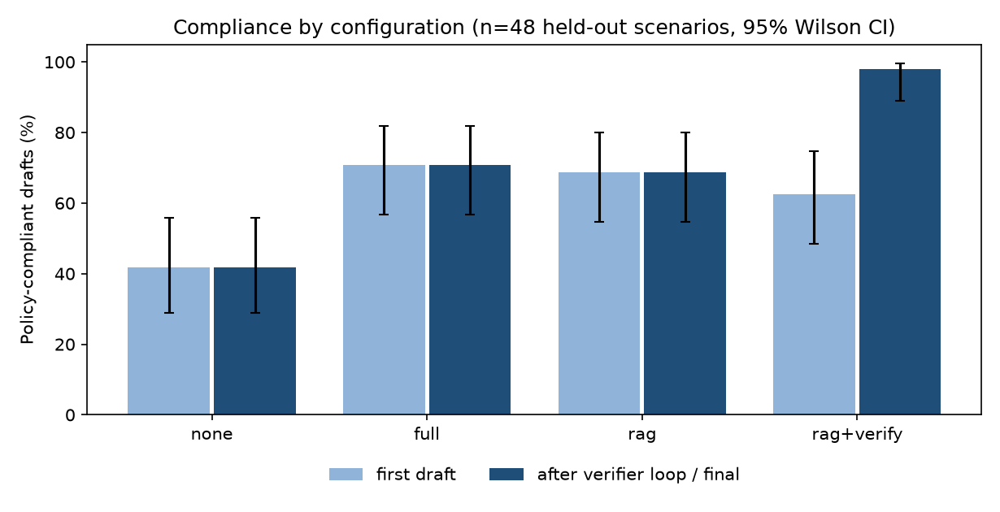

# Agent evaluation

**Final evaluation.** These customers were never used to tune prompts (customers whose drafts were inspected during development are excluded).

Model: `granite4:small-h` (temperature 0 for first drafts). 48 held-out customers who pass the expected-value gate, stratified to over-represent edge cases (no marketing consent, contact limit reached, new customers, high risk, high value). Every configuration sees the same customers.

**Scenario mix** (a customer can carry several tags): contact_limit 4, high_risk_m2m 16, high_value 9, loyalty_preferred 2, m2m_dsl 9, new_customer 16, one_year 7, opt_out 7, phone_only 4

*Compliant* = no policy violation from the deterministic verifier, ignoring citation rules. Compliance of a verifier-loop configuration's **final** draft is high by construction, which is why first-draft compliance (the effect of the prompt and the retrieved policy) is reported separately. The mandatory opt-out line is appended by the system when the model omits it (mandatory disclosures should not depend on a model). 'Offer matches playbook' compares the final offer with the first eligible entry in the segment's preferred order. CI = 95% Wilson interval.

## Results
| config | first draft compliant | final compliant | escalated | offer matches playbook | prompt tokens | LLM calls | LLM time / run |
|---|---|---|---|---|---|---|---|
| none | 20/48 (42%; 29-56) | 20/48 (42%; 29-56) | 0 | 4% | 420 | 1.00 | 6.9s |
| full | 34/48 (71%; 57-82) | 34/48 (71%; 57-82) | 0 | 65% | 2810 | 1.00 | 9.2s |
| rag | 33/48 (69%; 55-80) | 33/48 (69%; 55-80) | 0 | 71% | 1582 | 1.00 | 9.8s |
| rag+verify | 30/48 (62%; 48-75) | 47/48 (98%; 89-100) | 2 | 96% | 2609 | 1.54 | 13.5s |

## Paired comparisons
| contrast (paired, same scenarios) | only first succeeds | only second succeeds | exact McNemar p |
|---|---|---|---|
| first draft: full policy vs no policy | 16 | 2 | 0.0013 |
| first draft: RAG vs no policy | 15 | 2 | 0.0023 |
| first draft: RAG vs full policy | 4 | 5 | 1.0000 |
| offer matches playbook: full policy vs no policy | 30 | 1 | < 0.0001 |
| offer matches playbook: RAG vs no policy | 32 | 0 | < 0.0001 |
| offer matches playbook: RAG vs full policy | 7 | 4 | 0.5488 |
| offer matches playbook: rag+verify vs rag | 12 | 0 | 0.0005 |
| verifier loop on rag: final vs first draft | 17 | 0 | < 0.0001 |

## Which rules the first drafts break
| first-draft violation (share of scenarios) | none | full | rag | rag+verify |
|---|---|---|---|---|
| consent | 15% | 8% | 12% | 12% |
| contact_limit | 8% | 4% | 2% | 8% |
| discount_cap | 19% | 0% | 0% | 0% |
| eligibility | 25% | 8% | 10% | 10% |
| no_action | 0% | 6% | 2% | 2% |
| numbers | 12% | 0% | 0% | 0% |
| prediction_terms | 0% | 0% | 4% | 8% |
| terms | 0% | 8% | 2% | 2% |

## Grounding and retrieval
- full: valid citations on 31/48 (65%; 50-77) of first drafts
- rag: valid citations on 39/48 (81%; 68-90) of first drafts
- rag+verify: valid citations on 41/48 (85%; 73-93) of first drafts
- rag: mean context recall 1.00
- rag+verify: mean context recall 1.00

## Example repairs (first draft -> verifier feedback -> final)
**6178-KFNHS** (rag+verify)
- first-draft violations: [contact_limit] customer already had 3 contacts in 90 days (limit 3); the action must be NO_ACTION: offer_id NONE, discount_pct 0, duration_months 0 and an empty message
- final message: 

**0679-IDSTG** (rag+verify)
- first-draft violations: [contact_limit] customer already had 3 contacts in 90 days (limit 3); the action must be NO_ACTION: offer_id NONE, discount_pct 0, duration_months 0 and an empty message; [citations] cite at least one policy section id (for example offer_catalog#loyalty-discount); [citations] cite the catalog section for the chosen offer: offer_catalog#tech-support-trial
- final message: 

**1618-CFHME** (rag+verify)
- first-draft violations: [contact_limit] customer already had 3 contacts in 90 days (limit 3); the action must be NO_ACTION: offer_id NONE, discount_pct 0, duration_months 0 and an empty message
- final message: 
